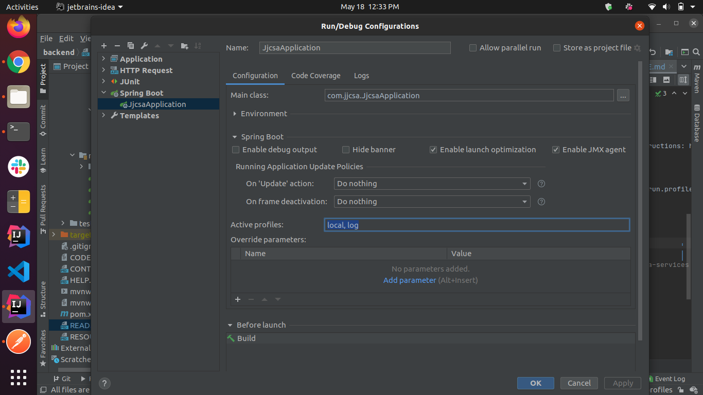

# JJCSA Backend Spring Boot Application

## Contributing:

For steps on how you can contribute, please follow the [Contributing guide](CONTRIBUTING.md)

## Resources:

For resources on various documentation and references, please refer [Resources](RESOURCES.md)

## Running the app through Docker:

1. Prerequisites:
   1. Docker (https://docs.docker.com/get-docker/)
   2. Java JDK 8 (https://docs.oracle.com/javase/8/docs/technotes/guides/install/install_overview.html)
   3. Maven (https://maven.apache.org/install.html)
   4. Keycloak: Follow instructions here: https://github.com/JJCSA/Authentication/tree/main#how-to-start

2. Clone this repository and navigate to the backend directory

    ```
    git clone git@github.com:JJCSA/backend.git
    cd backend
    ```

3. Build the docker image:

   ```shell
   mvn clean spring-boot:build-image -DskipTests
   ```

4. Start the application:

   ```shell
   docker-compose down && docker-compose pull && docker-compose up -d
   ```

5. You can test the App heath status by going to http://localhost:9080/actuator/health

## Running the app:

1. Clone this repository and navigate to the backend directory

    ```
    git clone git@github.com:JJCSA/backend.git
    cd backend
    ```

2. Install & configure Postgres in local machine  
  
        For Windows, Follow these instructions: https://www.2ndquadrant.com/en/blog/pginstaller-install-postgresql/
  
        For Mac, Follow these instructions: https://www.robinwieruch.de/postgres-sql-macos-setup
  
        For Ubuntu, Follow these instructions: https://phoenixnap.com/kb/how-to-install-postgresql-on-ubuntu

   Configuration:  
   
   In Postgres, create a new database called `jjcsa` and a role (user) with the name `admin` with password `jjcsa`  
        
   If not, create the same with the following steps:  
        
        # Open a psql terminal
        sudo -u postgres psql

        # Execute the following psql queries
        postgres=# create database jjcsa;
        postgres=# create user admin with encrypted password 'jjcsa';
        postgres=# grant all privileges on database jjcsa to admin;

3. (Optional) Start postgres through docker container:

   ```commandline
   cd postgres
   docker-compose up
   ```

4. Make sure Keycloak service is already running. If not, start the same with the following instructions: https://github.com/JJCSA/Authentication/tree/main#how-to-start  

5. Now navigate to the backend folder and run 
    ```
    mvn clean spring-boot:run -Dspring-boot.run.jvmArguments="-Dserver.port=9080" -Dspring-boot.run.profiles=local
    ```
    This will start you application server on port 9080.  
    
    If running the app in IntelliJ, make sure to add profiles to the Run Configuration:
    
    
    If the app is run in a docker container, add the env var for spring profile:
    ```
    docker run -e "SPRING_PROFILES_ACTIVE=stage" <IMAGE>
    ```
    
6. Now you can test the APIs using postman or any other external client. For the APIs that need authentication use the token returned by the login API. The authorization type would be Bearer token.
   
   Eg API: http://localhost:9080/api/users/login

7. You can test the App heath status by going to http://localhost:9080/actuator/health

## Documentation

The app uses [springdoc-openapi](https://springdoc.org) for API Documentation. 
To access the API documentation, access Swagger UI at [http://localhost:9080/swagger-ui.html](http://localhost:9080/swagger-ui.html)

## Postman config

Please find the Postman collection here: https://www.getpostman.com/collections/ee05e59d8d48a55a9663
